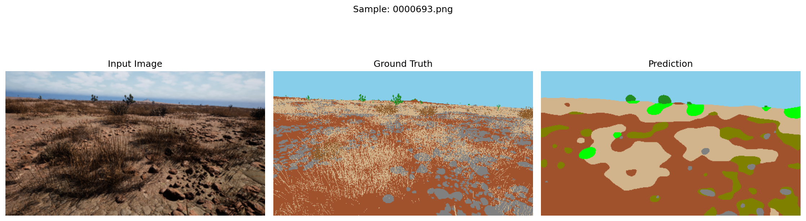
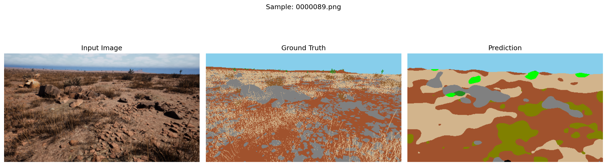
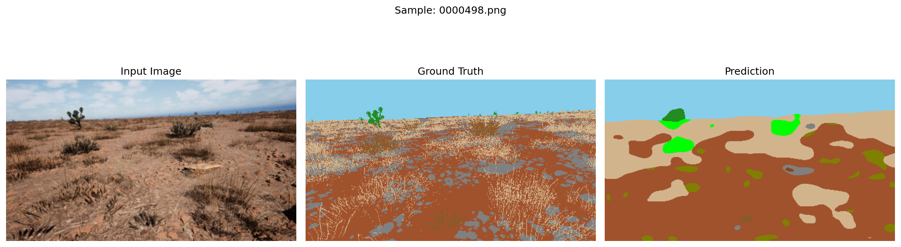
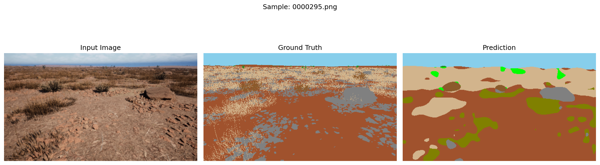
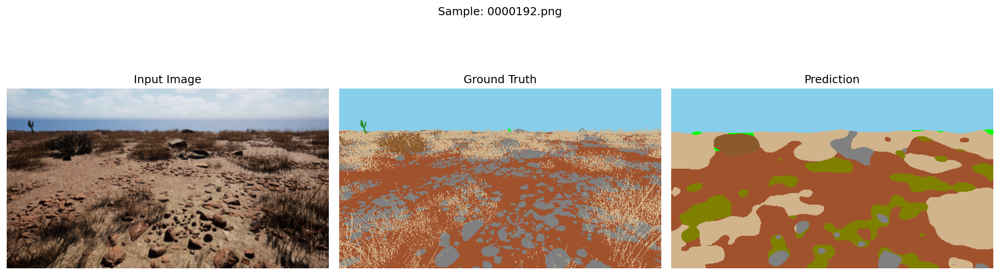

# 🏆 Semantic Segmentation Code Crunch — Hackathon Submission

<p align="center">
  
</p>

<p align="center">
  <a href="LICENSE"></a>
  
  
  
  
</p>

---

## 📌 Table of Contents

1. [Project Overview](#-project-overview)
2. [Model Architecture](#-model-architecture)
3. [Dataset](#-dataset)
4. [Training Configuration](#-training-configuration)
5. [Results & Metrics](#-results--metrics)
6. [Visualizations](#-visualizations)
7. [Getting Started](#-getting-started)
8. [Repository Structure](#-repository-structure)
9. [License](#-license)

---

## 🚀 Project Overview

This project tackles **off-road scene semantic segmentation** — the task of assigning a semantic class label to every pixel in an image captured in unstructured outdoor terrain. Applications include autonomous off-road vehicles, field robotics, and environmental monitoring.

**Our approach** leverages the pre-trained **DINOv2** vision transformer as a powerful frozen feature extractor, coupled with a custom **ASPP + FPN decoder head** designed for dense prediction at multiple scales. The full pipeline was trained and evaluated on a dedicated off-road segmentation dataset with **10 semantic classes**.

### ✨ Highlights

| Feature | Detail |
|---|---|
| Backbone | DINOv2 ViT-S14 (frozen, pre-trained) |
| Decoder | ASPP-FPN Segmentation Head |
| Input Resolution | 336 × 252 px (patch-size-14 aligned) |
| Classes | 10 semantic categories |
| Training Samples | 2,857 images |
| Validation Samples | 317 images |
| Best Val IoU | **0.5226** |
| Best Val Pixel Accuracy | **83.55%** |

---

## 🏗 Model Architecture

### Backbone — DINOv2 (ViT-S14)

We use Meta AI's **DINOv2 ViT-S/14** as a frozen feature extractor. It produces high-quality patch token embeddings of dimension **384**, which serve as rich semantic features without any fine-tuning of the backbone itself.

```
Input Image (3 × 252 × 336)
        │
        ▼
  DINOv2 ViT-S/14  ──── (frozen weights)
        │
        │  x_norm_patchtokens  [B, N, 384]
        ▼
  Reshape to spatial feature map  [B, 384, H/14, W/14]
```

### Decoder — ASPPFPNSegmentationHead

The decoder combines two complementary multi-scale reasoning strategies:

#### 1. ASPP (Atrous Spatial Pyramid Pooling)
Captures context at multiple receptive fields in parallel:
- **1×1 convolution** — local features
- **Dilated conv (rate=6)** — medium-range context
- **Dilated conv (rate=12)** — wider context
- **Dilated conv (rate=18)** — large-range context
- **Global Average Pooling** — scene-level context

All five branches are concatenated and projected, with 0.1 dropout for regularisation.

#### 2. FPN (Feature Pyramid Network)
Progressively upsamples the ASPP features back to a useful spatial resolution through two stages:

```
ASPP Output  [B, 256, H/14, W/14]
        │
     2× upsample + conv (256 → 128)
        │
     2× upsample + conv (128 → 64)
        │
  1×1 classifier conv  → logits [B, 10, H/14*4, W/14*4]
        │
  Bilinear upsample to full resolution
        │
  Output Mask  [B, 10, 252, 336]
```

BatchNorm + GELU activations are used throughout the decoder.

---

## 📦 Dataset

**Source:** [Offroad Segmentation Training Dataset — Kaggle](https://www.kaggle.com/)

| Split | Images |
|---|---|
| Train | 2,857 |
| Validation | 317 |

### Semantic Classes (10 categories)

| ID | Class | Colour |
|---|---|---|
| 0 | Background | ⬛ Black |
| 1 | Trees | 🌲 Forest Green |
| 2 | Lush Bushes | 🟢 Lime |
| 3 | Dry Grass | 🌾 Tan |
| 4 | Dry Bushes | 🟤 Brown |
| 5 | Ground Clutter | 🫒 Olive |
| 6 | Logs | 🪵 Saddle Brown |
| 7 | Rocks | 🪨 Gray |
| 8 | Landscape | 🏞 Sienna |
| 9 | Sky | 🔵 Sky Blue |

### Data Augmentation (Training)

| Transform | Parameters |
|---|---|
| Resize | 336 × 252 |
| ColorJitter | brightness=0.3, contrast=0.3, saturation=0.2 |
| RandomGrayscale | p=0.1 |
| GaussianBlur | kernel=5, σ ∈ [0.1, 2.0] |
| Normalize | ImageNet mean/std |

Validation uses only **Resize + Normalize** (no augmentation).

---

## ⚙️ Training Configuration

| Hyperparameter | Value |
|---|---|
| Batch Size | 4 |
| Epochs | 10 |
| Optimizer | AdamW |
| Learning Rate | 1e-4 (initial) |
| Max LR (OneCycle) | 3e-4 |
| Weight Decay | 1e-4 |
| LR Scheduler | OneCycleLR (5% warmup) |
| Loss Function | CombinedLoss (50% CrossEntropy + 50% Dice) |
| Gradient Clipping | max_norm = 1.0 |

---

## 📊 Results & Metrics

### Training Progression

| Epoch | Train Loss | Val Loss | Train IoU | Val IoU | Train Dice | Val Dice | Train Acc | Val Acc |
|---|---|---|---|---|---|---|---|---|
| 1 | 0.7508 | 0.5206 | 0.4352 | 0.4395 | 0.5641 | 0.5698 | 81.09% | 81.44% |
| 2 | 0.5124 | 0.4802 | 0.4674 | 0.4715 | 0.6016 | 0.6066 | 81.83% | 82.22% |
| 3 | 0.4789 | 0.4608 | 0.4866 | 0.4882 | 0.6255 | 0.6262 | 82.31% | 82.61% |
| 4 | 0.4625 | 0.4502 | 0.4944 | 0.4939 | 0.6323 | 0.6316 | 82.70% | 82.94% |
| 5 | 0.4511 | 0.4414 | 0.5045 | 0.5025 | 0.6432 | 0.6401 | 82.98% | 83.21% |
| 6 | 0.4431 | 0.4348 | 0.5139 | 0.5095 | 0.6523 | 0.6474 | 83.17% | 83.32% |
| 7 | 0.4337 | 0.4302 | 0.5213 | 0.5163 | 0.6608 | 0.6551 | 83.24% | 83.38% |
| 8 | 0.4269 | 0.4267 | 0.5262 | 0.5199 | 0.6645 | 0.6587 | 83.31% | 83.45% |
| **9** | **0.4233** | **0.4243** | **0.5288** | **0.5226 ⭐** | **0.6683** | **0.6618 ⭐** | 83.40% | 83.50% |
| 10 | 0.4248 | 0.4242 | 0.5291 | 0.5222 | 0.6684 | 0.6609 | 83.47% | **83.55% ⭐** |

⭐ = best result for that metric

### Best Validation Metrics Summary

| Metric | Value | Epoch |
|---|---|---|
| Best Val IoU | **0.5226** | 9 |
| Best Val Dice | **0.6618** | 9 |
| Best Val Pixel Accuracy | **83.55%** | 10 |
| Lowest Val Loss | **0.4242** | 10 |

### Test Set — Per-Class IoU

<p align="center">
  
</p>

| Class | IoU |
|---|---|
| Sky | **0.9540** 🏆 |
| Landscape | **0.5931** |
| Dry Grass | 0.4277 |
| Trees | 0.2261 |
| Dry Bushes | 0.1298 |
| Rocks | 0.0475 |
| Lush Bushes | 0.0002 |
| Background | 0.0000 |
| Ground Clutter | 0.0000 |
| Logs | 0.0000 |
| **Mean IoU** | **0.2849** |

**Key observations:**
- **Sky** is segmented near-perfectly (IoU = 95.4%), reflecting its high visual distinctiveness.
- **Landscape** and **Dry Grass** perform reasonably well, with rich appearance cues.
- Rare/small classes (**Lush Bushes, Logs, Ground Clutter**) suffer from class imbalance — a common challenge in off-road datasets.
- The train-val domain shift (outdoor lighting, terrain variation) partially explains the gap between validation IoU (~0.52) and test IoU (~0.28).

---

## 🖼 Visualizations

### Sample Test Predictions (Input | Ground Truth | Prediction)

<p align="center">
  
</p>
<p align="center">
  
</p>
<p align="center">
  
</p>
<p align="center">
  
</p>
<p align="center">
  
</p>

### Training Curves

<p align="center">
  
</p>

| Loss & Accuracy | IoU | Dice |
|---|---|---|
|  |  |  |

---

## 🛠 Getting Started

### Prerequisites

```bash
pip install torch torchvision
pip install Pillow matplotlib numpy tqdm
```

> A CUDA-capable GPU is strongly recommended for training.

### Running Training

Open and execute [`TRAIN_CODE.ipynb`](TRAIN_CODE.ipynb) in Jupyter or on Kaggle/Colab.

**Key steps inside the notebook:**
1. Mount/load the `Offroad_Segmentation_Training_Dataset` from Kaggle.
2. The `OffRoadDataset` class handles image–mask pairing and augmentation.
3. The `ASPPFPNSegmentationHead` model is instantiated with a frozen DINOv2 backbone.
4. Training runs for 10 epochs with `AdamW` + `OneCycleLR`; metrics and curves are saved automatically.

### Running Evaluation / Test Inference

Open and execute [`final-test-results.ipynb`](final-test-results.ipynb).

**This notebook:**
1. Loads the saved model checkpoint.
2. Runs inference on the test set.
3. Generates side-by-side comparison images (saved to `TEST_IMAGES_Results/`).
4. Computes per-class and mean IoU (saved to `evaluation_metrics.txt`).
5. Exports predicted masks to `TEST_IMAGES_Results/MASKS.zip`.

---

## 📁 Repository Structure

```
SEMANTIC_SEGMENTATION_CODE_CRUNCH/
│
├── TRAIN_CODE.ipynb              # Full training pipeline
├── final-test-results.ipynb      # Evaluation & test inference
├── evaluation_metrics.txt        # Test-set per-class IoU results
├── per_class_metrics.png         # Per-class IoU bar chart
│
├── TRAIN RESULS/                 # Saved training artefacts
│   ├── evaluation_metrics.txt    # Epoch-by-epoch training log
│   ├── training_curves.png       # Loss & pixel accuracy curves
│   ├── iou_curves.png            # IoU progression curves
│   ├── dice_curves.png           # Dice score curves
│   ├── all_metrics_curves.png    # Combined 4-panel metric plot
│   └── Train_Folder/             # Raw training logs
│
├── TEST_IMAGES_Results/          # Test predictions & comparisons
│   ├── sample_0_comparison.png   # Visual comparison (Input | GT | Pred)
│   ├── sample_1_comparison.png
│   ├── sample_2_comparison.png
│   ├── sample_3_comparison.png
│   ├── sample_4_comparison.png
│   ├── Test_Images/              # Raw test input images
│   └── MASKS.zip                 # Predicted segmentation masks (all test images)
│
└── LICENSE                       # MIT License
```

---

## 📄 License

This project is licensed under the **MIT License** — see the [LICENSE](LICENSE) file for details.

© 2026 Divyansh Sharma
